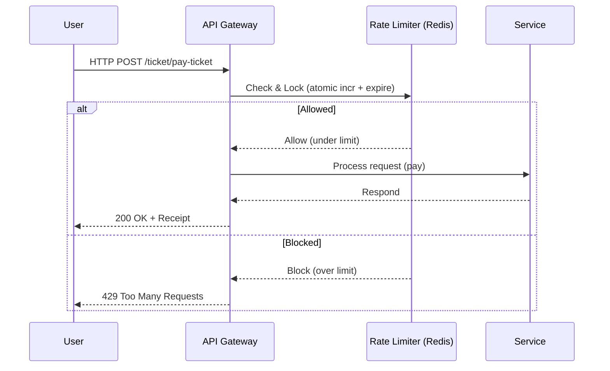
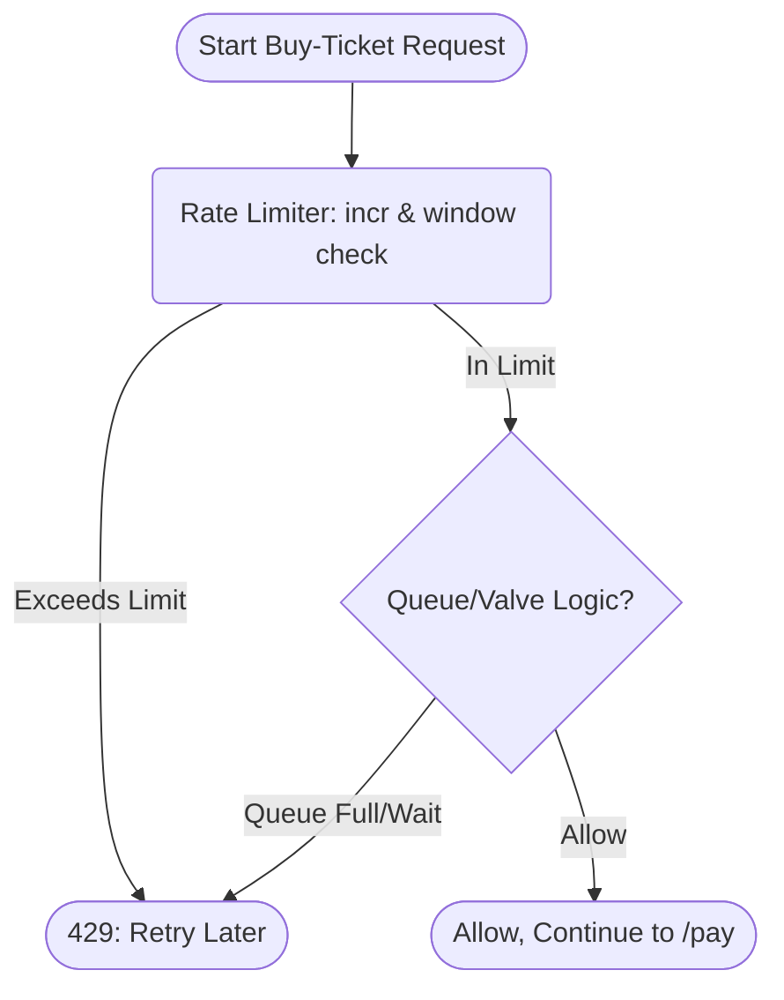

# 🚦 Distributed Rate Limiter: High-Concurrency, Flash-Sale Proof 🛡️

## 🏗️ Architecture Overview

This project implements a **Distributed Rate Limiter** built for high-concurrency and resilience in scenarios like "Flash Sales" where bot-driven inventory hoarding is likely, ensuring both performance and fairness.

- **Atomic Limiting:** Redis-backed counters (with expiry) enable atomic, distributed enforcement.
- **Plug-n-Play Algorithms:** New algorithms (Token Bucket, Leaky Bucket, etc.) can be swapped in thanks to clean separation using the _Strategy_ pattern.
- **Queue-as-Valve:** Custom logic queue users during spikes, avoiding database contention and hot-row locks.

---

## ✨ Key Features

- **Distributed, Atomic Rate Limiting:** Enforces limits safely across all instances using Redis; all increments and expiries are done atomically.
- **Multi-Route, Multi-Algorithm Ready:** Different rate limiting logic (window, token bucket, queue) can be swapped or stacked per route.
- **Battle-Tested for Flash Sales:** Special attention to /pay-ticket flows, queue logic, and anti-bot pressure valve for inventory saving.
- **Pluggable Backends:** Redis used out of the box, but storage is pluggable via Adapter pattern for future scalability (SQL, cloud).
- **Vertical Slice & Clean Separation:** Business, infrastructure, and framework code are cleanly separated (easy to test, extend, and maintain).
- **Comprehensive Middleware Chaining:** Auth, validation, and rate limiting applied in explicit order per endpoint keeping critical paths safe.
- **Container-First:** Dockerfile and docker-compose provide instant multi-instance cluster and dependency setup (Redis included).
- **Type-Safe, Validated IO:** All API inputs validated by zod and Typescript, ensuring correct usage and safer backend logic.
- **Instant Observability:** Console logs for core rate limiting operations and limits; easy to plug to advanced monitoring (e.g., Prometheus).

## 📚 Table of Contents

- [✨ Key Features](#-key-features)
- [🏗️ Architecture Overview](#️-architecture-overview)
- [🗂️ Project File Structure](#️-project-file-structure)
- [👾 Design Patterns & Rationale](#-design-patterns--rationale)
- [🚀 Use Cases](#-use-cases)
- [🦾 System Sequence Diagram](#-system-sequence-diagram)
- [🔥 Flash Sale Logic (Queue Flowchart)](#-flash-sale-logic-queue-flowchart)
- [🔎 Deep Dive: Flash Sales & Inventory Contention](#-deep-dive-flash-sales--inventory-contention)
- [⚡ Quick Start](#-quick-start)
- [🧩 Pseudocode: Applying the Limiter](#-pseudocode-applying-the-limiter)
- [🔒 Environment Vars](#-environment-vars)
- [📜 License](#-license)

## 🗂️ Project File Structure

```text
back/
├── src/
│   ├── application/
│   │   ├── shared/
│   │   │   └── infrastructure/
│   │   │       └── rate-limiter/
│   │   │           ├── RedisClient.ts        (Redis connection singleton)
│   │   │           ├── rate-limiter-values.ts (Config: window & max per route)
│   │   │           ├── buy-ticket.rate-limiter.ts (Flash sale limiter logic)
│   │   │           └── Login.rate-limiter.ts (Login brute force limiter)
│   │   └── buy-ticket/   (Pay logic/services)
│   └── presentation/
│       ├── controllers/   (Controller logic)
│       ├── middlewares/   (Pure, chainable rate limiter(s))
│       └── routes/        (Express route setup)
├── package.json           (Dependencies)
├── .env                   (Environment vars)
├── Dockerfile             (Container setup)
└── docker-compose.yml     (Multi-node, Redis cluster)
```

**Key Modules Explained:**

- `rate-limiter/` – Core limiting logic, Redis client singleton, per-route configs.
- `middlewares/` – Express rate limiting middlewares (can be attached/stacked per route).
- `routes/` – HTTP endpoints e.g. `/ticket/pay-ticket`, protected by middlewares.
- `controllers/` – Upstream business logic after limiter.

## 👾 Design Patterns & Rationale

- **Strategy Pattern:**
  - All limiting strategies (sliding window, fixed window, token bucket, queue, etc.) are modular for easy swapping.
- **Adapter Pattern:**
  - Backends (e.g. Redis, future Memcached, SQL) are isolated into their own adapters—change storage without touching algorithms.
- **Middleware/Controller Separation:**
  - Rate limiting checks are performed as early as possible (in middleware), keeping business logic (controllers) clean and testable.

---

## 🚀 Use Cases

- 🔒 **Security**: Stop brute-force attacks, login floods, DDoS (see [`use-cases.md`](./use-cases.md)).
- 🌐 **System Reliability**: Prevent one client/system from overloading backend/db/resources.
- 🎟️ **Flash Sales**: Smooth massive spikes; prevent inventory hoarding/bot lockouts.
- 💸 **Cost Control**: Prevent "bill shock" when using costly APIs.

---

## 🛣️ API Endpoint Reference

### Authentication & Auth-Flow (`/auth`)

| Method | Path                  | Description                                    | Middlewares / Rate Limiters         |
| ------ | --------------------- | ---------------------------------------------- | ----------------------------------- |
| POST   | `/auth/signup`        | Register a new user.                           | Schema validation                   |
| POST   | `/auth/login`         | Login user, issues JWT.                        | Login rate limiter, schema validate |
| POST   | `/auth/refresh-token` | Refresh an access token using a refresh token. | Schema validation                   |

### Ticket Purchases (`/ticket`)

| Method | Path                 | Description                        | Middlewares (Order Applied)                                                      |
| ------ | -------------------- | ---------------------------------- | -------------------------------------------------------------------------------- |
| POST   | `/ticket/pay-ticket` | Attempt purchase/pay for ticket(s) | requireAuth → BuyTicketRateLimiterMiddleware → zodValidate → payTicketController |

Each endpoint chains middleware to enforce auth, input validation, and—critically—rate limits. Endpoints are organized for separation of concerns and production security.

---

## 🦾 System Sequence Diagram



---

## 🔥 Flash Sale Logic (Queue Flowchart)



---

## 🔎 Deep Dive: Flash Sales & Inventory Contention

> "Flash Sales (like concert tickets) cause huge spikes: thousands of users—plus scalper bots—try to buy at the exact same moment, potentially locking up inventory database rows for minutes."

### ⚠️ The Problem: Inventory Lock Contention

- **Bot Scalpers:** Scripted bots hammer `/buy-tickets`, locking DB rows before real users have a chance.
- **Database Choke:** Thousands of parallel "buy" attempts swamp DB with locks/transactions.
- **Legitimate Users Lose:** Actual fans stuck waiting or denied.

### 🛡️ The Solution: Distributed Rate Limiter as Pressure Valve

- **Streaming, Not Spiking:** The limiter turns a massive burst into a manageable one-at-a-time flow (throttling scalpers and humans alike).
- **Fairness:** Ensures only a safe, allowed number hit DB per second; excess is denied/queued.
- **Atomic at Edge:** Redis checks & blocks happen _before_ app logic—protecting from even hitting the DB.

---

## ⚡ Quick Start

```bash
# 1. Clone & set env
cp back/.env.example back/.env # Edit secrets, set window/limit per env

# 2. Build and run dependencies (multi-backend + Redis)
docker-compose up --build

# 3. Hit the API
curl -X POST http://localhost:4001/ticket/pay-ticket \
     -H 'Authorization: Bearer <token>' \
     -d '{"ticketUuids": ["uuid1", "uuid2"], "creditCard": "..."}'

# On rate limit exceeded (burst):
#   HTTP/1.1 429 Too Many Requests
#   { "message": "Rate limit exceeded. Try again in N seconds."}
```

---

## 🧩 Pseudocode: Applying the Limiter

```typescript
// Express route setup
router.post(
  "/pay-ticket",
  requireAuth, // JWT token required first
  BuyTicketRateLimiterMiddleware, // <--- Rate Limiter here!
  zodValidate(PayTicketInputSchema), // Input validation
  payTicketController // Only called if under limit
);
```

---

## 🔒 Environment Vars

| Key                                     | Purpose                             |
| --------------------------------------- | ----------------------------------- |
| `PORT`                                  | App port (default: 4000)            |
| `JWT_SECRET`                            | Secret for JWT signing              |
| `REDIS_HOST`, `REDIS_PORT`, `REDIS_URL` | Redis connection details            |
| `LOGIN_RATE_LIMIT_WINDOW_SECONDS`       | Rate limit window (login)           |
| `LOGIN_RATE_LIMIT_MAX_REQUESTS`         | Max login attempts per window       |
| `BUY_TICKER_RATE_LIMIT_WINDOW_SECONDS`  | Rate limit window (buy)             |
| `BUY_TICKER_RATE_LIMIT_MAX_REQUESTS`    | Max buy-tickets attempts per window |

---

## 📜 License

[MIT](LICENSE)
